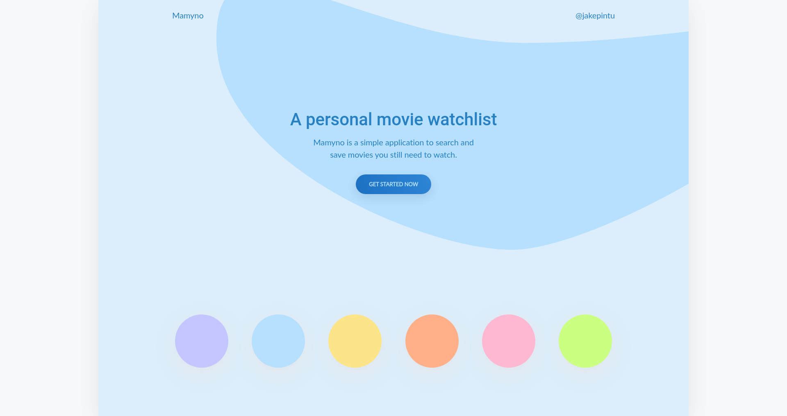
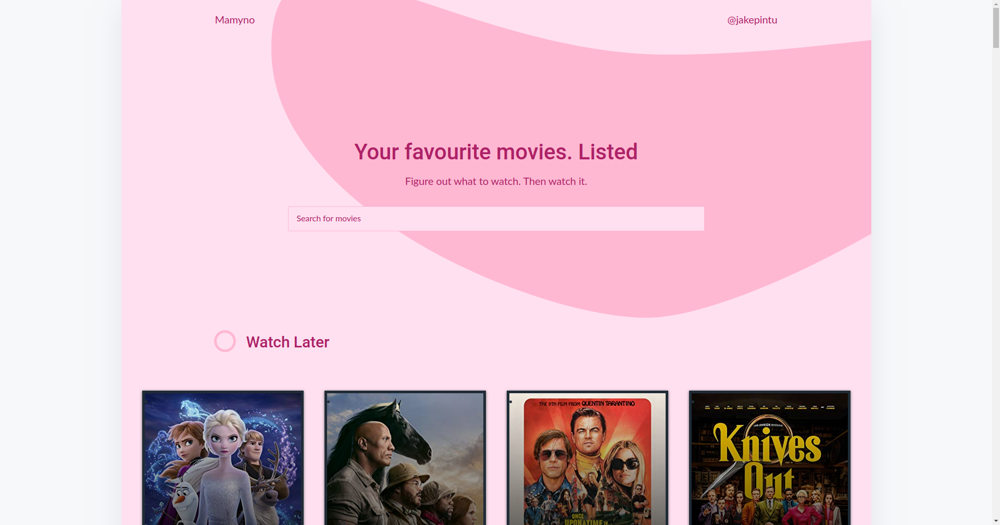
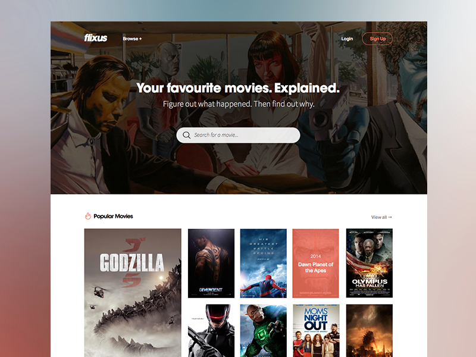
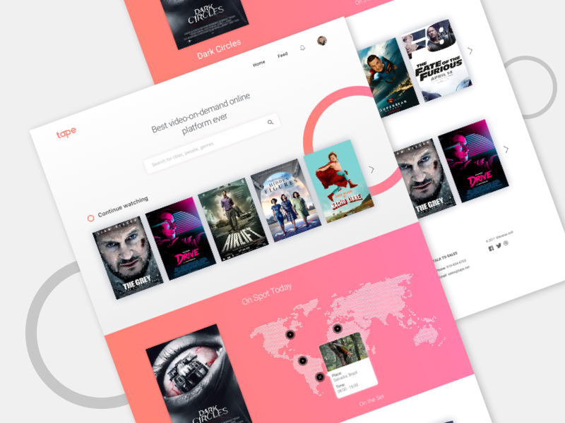

# Mamyno Movie App

> An application where users can search for movies/series/shows and add to their watch list. After watch the movie/series/show they can remove the movie/series/show from their watch list.

## [View Live Preview](https://jakepintu.github.io/mamyno-movie-app/)

## Table of contents

- [General info](#What-is-your-motivation-for-creating-this-project)
- [Screenshots](#Screenshots)
- [Technologies](#Technologies)
- [Features](#Features)
- [Setup](#Setup)
- [Folder Structure](#Folder-Structure)
- [3rd Party API(s)](#What-3rd-Party-APIs-will-you-integrate-with)
- [Stretch Goals](#Will-you-try-to-implement-any-stretch-features)
- [Code Example](#Code-Example)
- [Inspiration](#Inspiration)
- [Process](#What-will-be-your-process)
- [Status](#Status)
- [Contact](#Contact)

## What is your motivation for creating this project?

My motivation for creating this project is I love to watch movies/series and I always forgot movies/series names which I want to watch.

[Go To Top](#Table-of-contents)

## Screenshots




[Go To Top](#Table-of-contents)

## Technologies

- HTML5
- Scss
- Vanilla JavaScript
- No frameworks

[Go To Top](#Table-of-contents)

## Features

- [ ] Users can search for movies/series/show.
- [ ] Users can add movies/series/shows to watch list.
  - [ ] Using LocalStorage
- [ ] Users can view the watch list.
- [ ] Users can delete movies from the watch list.

To-do list:

- [ ] Users can select the status for the movie:
  - Watching
  - Done
- [ ] Users can select a platform where they will watch the movie:
  - Netflix
  - Amazon
  - Hulu
  - Showtime
  - Theater
  - Apple TV
- [ ] Users can add a platform where they want to watch the movie.
- [ ] Users can delete a platform.
- [ ] Users can update a platform.
- [ ] Users can give tags to the movies, so later they can filter through it
  - Anime
  - Comedy
  - Weird
  - Action
  - Horror
  - News
  - Animation
  - Science
  - Drama
  - Sci-Fi
  - Marvel
  - Standup
- [ ] Users can create the tags for the movies.
- [ ] Users can delete the tags for the movies.
- [ ] Users can update the tags for the movies.

[Go To Top](#Table-of-contents)

## Setup

```
git clone https://github.com/jakepintu/mamyno-movie-app.git
```

```
npm install

OR

yarn install
```

```
npm start

OR

yarn start
```

[Go To Top](#Table-of-contents)

## Folder Structure

```
├── package.json
├── README.md
└── src
    ├── index.html
    ├── app.js
    ├── js
    │   ├── animation.js
    │   ├── api.js
    │   ├── pages.js
    │   ├── popularMovies.js
    │   └── theme.js
    └── scss
        ├── abstracts
        │   ├── _functions.scss
        │   ├── _include-media.scss
        │   ├── _mixins.scss
        │   └── _variables.scss
        ├── base
        │   ├── _base.scss
        │   ├── _helpers.scss
        │   └── _typography.scss
        ├── components
        │   ├── _buttons.scss
        │   └── _forms.scss
        ├── layout
        │   ├── _header.scss
        │   ├── _hero.scss
        │   ├── _main.scss
        │   └── _movies.scss
        ├── _normalize.scss
        ├── _animation.scss
        ├── _themes.scss
        └── style.scss
```

[Go To Top](#Table-of-contents)

## What 3rd Party API(s) will you integrate with?

OMDb (The Open Movie Database) API

- Link to the API documentation here - https://www.omdbapi.com/

[Go To Top](#Table-of-contents)

## Will you try to implement any stretch features?

- [ ] User can add a date to the movie.
- [ ] User can update the date.
- [ ] User can delete the date.
- [ ] User can view the movie on the calendar.
- [ ] Use a linter (eslint)
- [ ] Mobile first approach
- [ ] SEO friendly tags
- [ ] UI Animations
- [ ] Use plain CSS with Flexbox
- [ ] Settings persistence in the browser with Local Storage or IndexDB
- [ ] Structure your javascript code in an MV\* pattern (No 3rd party libraries)
- [ ] Use a state management pattern in your JavaScript code (No 3rd party libraries)
- [ ] Multiple pages with DOM manipulation (SPA) instead of multiple html files.
- [ ] Document JavaScript with JSDoc
- [ ] E2E testing
- [ ] 100% lighthouse score
- [ ] Use a CI / CD pipeline

[Go To Top](#Table-of-contents)

## Code Example

- [State](#State)
- [API](#API)
- [Animations](#Animations)
- [Themes](#Themes)
- [Vanilla JavaScript SPA](#Vanilla-JavaScript-SPA)
- [Event Listeners](#Event-Listeners)

### State

```js
let state = {
  movies: [],
  watchLaterMovies: [],
  input: '',
};

if (JSON.parse(localStorage.getItem('state'))) {
  state = JSON.parse(localStorage.getItem('state'));
}
```

[Go to Code Example](#Code-Example)

[Go To Top](#Table-of-contents)

### API

```js
const generateMovie = (movie, buttonName, buttonClass = '') => `<li></li>`;

const showWatchLaterMovies = () => {
  if (state.watchLaterMovies.length > 0) {
    // ...
    state.watchLaterMovies.forEach((movie) => {
      watchingMovies.innerHTML += generateMovie(
        movie,
        'Remove',
        'remove-button',
      );
  }
  const buttons = document.querySelectorAll('.remove-button');
  buttons.forEach((button) => {
    button.addEventListener('click', () => {
      state.watchLaterMovies.forEach((movie) => {
        if (movie.imdbID === button.dataset.movieid) {
          state.watchLaterMovies = state.watchLaterMovies.filter(
            (m) => m.imdbID !== button.dataset.movieid,
          );
          showWatchLaterMovies();
          localStorage.setItem('state', JSON.stringify(state));
          }
        });
      });
    });
  } else {
    // ...
  }
}

const showPopularMovies = () => {
  state.popularMovies = popularMoviesData;
  // ...
};

const getMovies = async input => {
  const url = API_KEY + value;
  const res = await fetch(url);
  const data = await res.json();
  state.movies = data.Search;
  // ...
  if (state.movies) {
    state.movies.forEach((movie) => {
      list.innerHTML += generateMovie(movie, 'Watch Later');
      themes.style.display = 'none';
    });
  }
  const buttons = document.querySelectorAll('.watch-later-button');
  // ...
};
```

[Go to Code Example](#Code-Example)

[Go To Top](#Table-of-contents)

### Animations

```js
const toggleAnimation = () => {
  themeOne.classList.toggle('paused');
  // ...
};

const fadeInUpAnimation = () => {
  if (themeOne.classList.contains('paused')) {
    themeOne.classList.remove('fadeInUp');
    // ...
    toggleAnimation();
  } else {
    themeOne.classList.add('fadeInUp');
    setTimeout(() => {
      themeOne.classList.remove('fadeInUp');
      // ...
    }, 1000);
  }
};

const rubberBandAnimation = () => {
  if (rubberBand.classList.contains('rubberBand')) {
    if (rubberBand.classList.contains('paused')) {
      rubberBand.classList.remove('rubberBand');
      toggleAnimation();
    }
  } else if (rubberBand.classList.contains('paused')) {
    toggleAnimation();
    // ...
    setTimeout(() => {
      // ...
      toggleAnimation();
    }, 1000);
  } else {
    // ...
    setTimeout(() => {
      // ...
      toggleAnimation();
    }, 1000);
  }
};
```

[Go to Code Example](#Code-Example)

[Go To Top](#Table-of-contents)

### Themes

```js
const changeThemeColor = (color1, color2, color3, color4) => {};

const removeInputPlaceholderColor = () => {
  [1, 2, 3, 4, 5, 6].forEach(num => {
    input.classList.remove(`color${num}`);
  });
};

const changeThemeOne = () => {
  toggleAnimation();
  changeThemeColor('#c4c6ff', '#5d55fa', '#7069fa', '#e0e8f9');
  removeInputPlaceholderColor();
  input.classList.add('color1');
  rubberBandAnimation();
  fadeInUpAnimation();
};

const changeThemeTwo = () => {};
const changeThemeThree = () => {};
const changeThemeFour = () => {};
const changeThemeFive = () => {};
const changeThemeSix = () => {};
```

[Go to Code Example](#Code-Example)

[Go To Top](#Table-of-contents)

### Vanilla JavaScript SPA

```html
<div class="page-1"></div>
<div class="page-2"></div>
```

```js
const page1 = document.querySelector('.page-1');
const page2 = document.querySelectorAll('.page-2');

const showPage1 = () => {
  page1.style.display = '';
  page2.forEach(page => {
    page.style.display = 'none';
  });
  setTimeout(() => {
    themes.style.display = '';
  }, 0);
  rubberBandAnimation();
  fadeInUpAnimation();
};

const showPage2 = () => {
  showWatchLaterMovies();
  showPopularMovies();
  page1.style.display = 'none';
  page2.forEach(page => {
    page.style.display = '';
  });

  if (!(movies.innerHTML === '')) {
    setTimeout(() => {
      themes.style.display = 'none';
    }, 0);
  }

  rubberBandAnimation();
  fadeInUpAnimation();
};

showPage1();
```

[Go to Code Example](#Code-Example)

[Go To Top](#Table-of-contents)

### Event Listeners

```js
// Switch Pages - SPA
brand.addEventListener('click', showPage1);
heroButton.addEventListener('click', showPage2);

// Toggle Navbar
username.addEventListener('click', navToggle);

// Form submit
form.addEventListener('submit', formSubmitted);

// Change themes
themeOne.addEventListener('click', changeThemeOne);
themeTwo.addEventListener('click', changeThemeTwo);
themeThree.addEventListener('click', changeThemeThree);
themeFour.addEventListener('click', changeThemeFour);
themeFive.addEventListener('click', changeThemeFive);
themeSix.addEventListener('click', changeThemeSix);
```

[Go to Code Example](#Code-Example)

[Go To Top](#Table-of-contents)

## Inspiration




[Go To Top](#Table-of-contents)

## What will be your process?

- What project management tool will you use?
  - I will use Github Projects, to break down project in smaller, manageble pieces and track their progress. You can view it [here](https://github.com/jakepintu/mamyno-movie-app/projects/1).
- How often will you commit your code?
  - I will aim to commit code every day
- How will you test your web site?
  - I will test the API with Postman.
  - I will test the finished website on my computer.
- How will you design the layout of your website? Will you use a wireframing tool? Will you draw it on paper?
  - I will use https://wireframe.cc/

[Go To Top](#Table-of-contents)

## Status

Project is: _in progress_

[Go To Top](#Table-of-contents)

## Contact

Created by [@jakepintu](https://www.twitter.com/@jakepintu) - feel free to contact me!

[Go To Top](#Table-of-contents)
